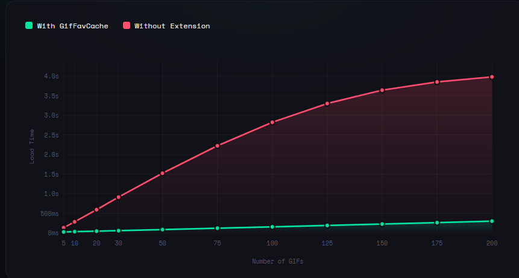

GifFavCache
A plugin for Equicord / Vencord that caches your favorited GIFs locally so they load from memory instead of re-fetching from Discord's CDN every time.

Features
GIFs load from local memory on subsequent opens. The cache persists across Discord restarts via IndexedDB and is preloaded 5 seconds after Discord launches. Newly favorited GIFs are cached immediately when you heart them. The plugin also listens to USER_SETTINGS_PROTO_UPDATE, so favorites added on mobile or another device get cached too, and it periodically re-reads your favorites list to catch anything new.
The plugin settings include a cache inspector showing every cached GIF, its size, when it was cached, and buttons to delete individual entries or wipe the whole cache.

Installation
Prerequisites

Git
Node.js v18+
pnpm — install with npm install -g pnpm or corepack enable

Steps
1. Clone Equicord
bashgit clone https://github.com/Equicord/Equicord
cd Equicord
2. Install dependencies
bashpnpm install
3. Add the plugin
Copy the GifFavCache folder into src/userplugins/:
Equicord/
└── src/
    └── userplugins/
        └── GifFavCache/
            └── index.tsx
4. Build and inject
bashpnpm build
pnpm inject
Select your Discord install when prompted (Stable / PTB / Canary).
5. Restart Discord
Fully quit Discord (right-click tray icon → Quit) and relaunch it.
6. Enable the plugin
Go to Settings → Plugins → GifFavCache and toggle it on.

Settings
All settings are in Settings → Plugins → GifFavCache:
SettingDefaultDescriptionPreload on startuptrueCache all favorites 5s after Discord launchesRefresh interval30 minHow often to re-scan favorites. Set to 0 to disableMax cache entries200IndexedDB entry limit — oldest are pruned automatically
Below the settings is the cache inspector: total GIF count, total storage size, and a list of every cached entry with filename, size, and cache date. The ↻ Refresh button reloads the list from IndexedDB, 🗑 Clear All wipes the entire cache, and the ✕ button on each row deletes a single entry.

Where is the database?
The cache lives in IndexedDB inside Discord's Electron browser context. To inspect it directly:

Open Discord DevTools: Ctrl+Shift+I
Go to the Application tab
Expand IndexedDB in the left sidebar
Look for EquicordGifFavCache → gifs

Each entry stores the GIF blob, its URL, and a timestamp. The cache inspector in plugin settings is easier for day-to-day use.

Known limitations

Tenor proxy URLs (images-ext-1.discordapp.net) are skipped. Discord's CDN proxy for Tenor blocks cross-origin fetches. Direct Tenor URLs (media.tenor.com) and Discord attachment GIFs cache fine.
Discord CDN attachment URLs contain expiry tokens (?ex=...). If a URL expired before it was cached, it fails silently and retries on the next refresh cycle.
The plugin caches in the background and preloads into memory. It does not patch Discord's webpack or intercept the renderer.

If the plugin breaks after a Discord update
Discord periodically rebuilds its frontend. If things stop working:

Check the DevTools console for [GifFavCache] errors
The most likely cause is UserSettingsProtoStore being renamed. Run this in the console to find it:

js   Vencord.Webpack.findAll(m => m?.getName?.()?.includes?.("UserSettings")).map(m => [m.getName(), Object.getOwnPropertyNames(Object.getPrototypeOf(m))])

DM me on Discord at ns5h with the new name (I don't check this very often)

Preview

License
MIT
